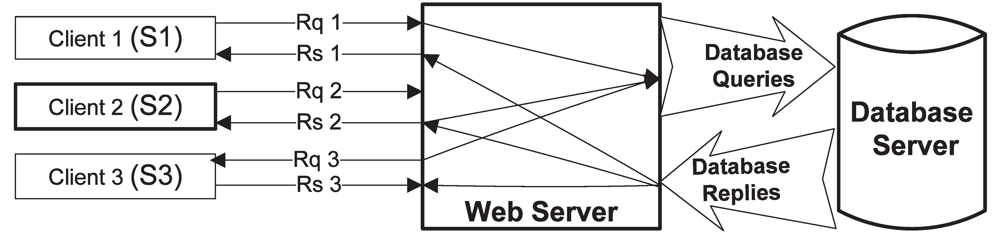

Partes de una Web
=================

Una Aplicacion web ó un sito web que es casi lo mismo se puede dividir en dos grandres areas el **"Frontend"** y el **"Backend"**. 

La primera que cubriremos en este texto es el area del Frontend el cual es responsable de toda la parte visual de la aplicasion, al igual de la integracion con el dispositivo cliente que puede ser desde un navegador web hasta un dispositivo movil como un smartphone. 

La segunda el Backend es la parte que no vemos y se ejecuta en un servidor remoto, esta pieza es vital para muchos sitios ya que es la que nos permite comunicarnos con otros usuarios, almacenar datos, ejecutar procesos entre otras tantas maravilla, pero sera hasta el final que toquemos este tema. 

