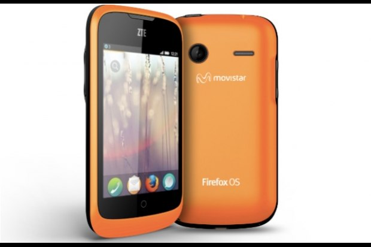

Cómo se construye Firefox OS.
=============================

Firefox OS está contruido sobre tres pilares principales, los cuales describiremos a continuación en este texto. Los cuales en conjunto crean un ambiente especial para la creación de aplicaciones de una manera nunca antes vista, rápidas, ligeras, flexibles y altamente portables.

##Arquitectura de FirefoxOS

###1. Gaia

Es la *interfaz gráfica* del sistema operativo. Todo lo que aparece en la pantalla desde que B2G se inicia, es parte de Gaia. Es decir, las aplicaciones tales como la pantalla de bloqueo, el marcador telefónico, la aplicación de mensajes de texto, etc., son parte de Gaia. Esta interfaz gráfica está escrita enteramente en HTML, CSS y JavaScript.

### 2. Gecko

Es el *entorno de ejecución*. En Gecko están implementados los estándares de HTML, CSS y JavaScript; y permite que esas interfaces se ejecuten correctamente en los distintos sistemas operativos. Esto significa que Gecko consiste en una serie de pilas de gráficos, un motor de dibujado y una máquina virtual para JavaScript, entre otras cosas.

### 3. Gonk

Es el *"sistema operativo"* de bajo nivel de *B2G*. A grandes rasgos, consiste en un kernel Linux y una capa de abstracción de hardware.

### 4. Dispositivo

Al momento de escribir este texto son pocos los dispositivos que incluyen el sistema operativo Firefox OS, mismo que listamos a continuación.

##### Alcatel
- Alcatel one touch fire *[3.5" HVGA, 320x480 pixels]*

#####Geeksphone
- Keon *[3.5" HVGA, 320x480 pixels]*

- Peak / Peak+ *[4.3" qHD 960×540 pixels]*

##### ZTE
- ZTE Open *[3.5" HVGA, 320x480 pixels]*

[1]: http://es.wikipedia.org/wiki/Firefox_OS "Firefox OS en Wikipedia"
